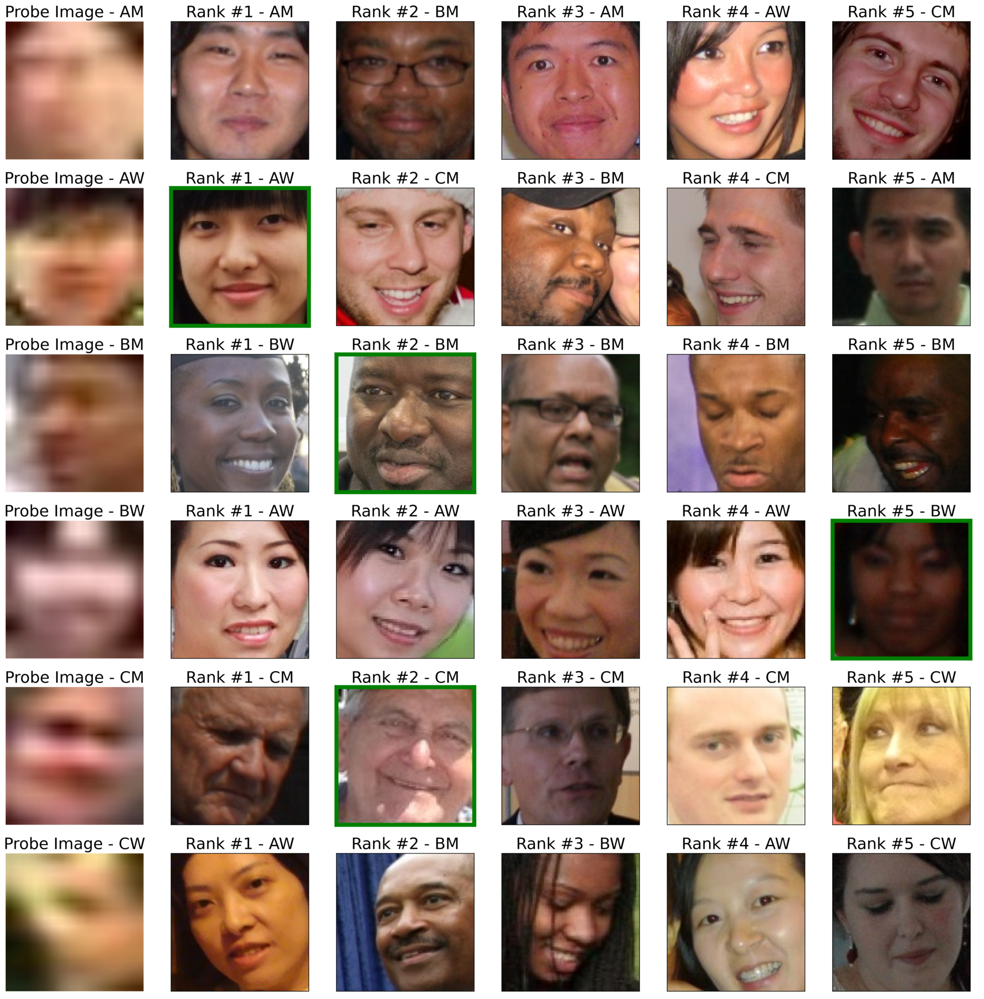

# (Un) fair Exposure in Deep Face Rankings at a Distance

This is the official repository of the paper entitled "(Un) fair Exposure in Deep Face Rankings at a Distance", 
published in: 2023 IEEE International Joint Conference on Biometrics (IJCB)

The original paper is available <a href="https://ieeexplore.ieee.org/abstract/document/10449007/" target="_blank">here</a>. 

This codebase is also the original one for the paper entitled  "Fairness of Exposure in Forensic Face Rankings", 
published in: 2023 13th Italian Information Retrieval Workshop (IIR), available <a href="https://ceur-ws.org/Vol-3448/paper-12.pdf" target="_blank">here</a>. 
<br>
<div align="center">
  
</div>
<br>
## Authors
<ul>
<li> Andrea Atzori (University of Cagliari) <a href="https://scholar.google.com/citations?hl=it&user=3_Z6fQ4AAAAJ" target="_blank">Google Scholar</a> (<a href="mailto:andrea.atzori@ieee.org" target="_blank">Contact via Email</a>) 
<li> Gianni Fenu (University of Cagliari) <a href="https://scholar.google.com/citations?user=riCjuhkAAAAJ&hl=it" target="_blank">Google Scholar</a>
<li> Mirko Marras (University of Cagliari) <a href="https://scholar.google.com/citations?user=JZhqKBIAAAAJ&hl=it&oi=ao" target="_blank">Google Scholar</a>
</ul>

<br>
<div align="center">
  

</div>
<br>

We provide a Pytorch toolbox for Face Image Degradation (1) and Face Recognition training and testing (2) and Face Rankings Evaluation (3). 

1) The Image Degradation module provides a training part for both GANs and their Discriminators and a use/evaluation part that degrades HR datasets
<br>
<div align="center">
  
</div>
<br>


2) The Face Recognition module provides a training part with various SOTA Face Recognition backbones and heads and
an evaluation part that:
- Provides evaluations of the given model(s) in order to obtain metrics like ROC curves, AUCs and EERs.
- Provides metrics as FRR@FARs Degree of Bias across multiple factors (e.g.: gender and ethnicity and their combinations) and imposed security thresholds in Face Verification scenarios.


## Requirements
- Python >= 3.8
- PyTorch >= 1.10.0
- DeepFace == 0.0.72
- MatPlotLib == 3.5.2
- Scikit Learn == 1.0.1
- Scipy == 1.7.1
- Seaborn == 0.11.2

In order to install all the necessary prerequisites, you can simply execute the following command: \
`pip install -r requirements.txt`

## Face Degradation Module

#### GAN Training
From Demographic Bias in Deep Face Recognition in The Wild (follow <a href="https://github.com/atzoriandrea/Demographic-Bias-in-Deep-Face-Recognition-in-The-Wild/tree/main/src/1_image_degradation/training_module/README.md" target="_blank"> this README</a>)
#### GAN Evaluation
From Demographic Bias in Deep Face Recognition in The Wild (follow <a href="https://github.com/atzoriandrea/Demographic-Bias-in-Deep-Face-Recognition-in-The-Wild/tree/main/src/1_image_degradation/evaluation_module/README.md" target="_blank"> this README</a>)
#### Image Degradation
From Demographic Bias in Deep Face Recognition in The Wild (follow <a href="https://github.com/atzoriandrea/Demographic-Bias-in-Deep-Face-Recognition-in-The-Wild/tree/main/src/1_image_degradation/degradation_module/README.md" target="_blank"> this README</a>)


## Face Recognition Module
#### Model Training
From Demographic Bias in Deep Face Recognition in The Wild (follow <a href="https://github.com/atzoriandrea/Demographic-Bias-in-Deep-Face-Recognition-in-The-Wild/tree/main/src/1_image_degradation/degradation_module/README.md" target="_blank"> this README</a>)
#### Dataset Preprocessing and combined models training
From Demographic Bias in Deep Face Recognition in The Wild (follow <a href="https://github.com/atzoriandrea/Demographic-Bias-in-Deep-Face-Recognition-in-The-Wild/tree/main/src/1_image_degradation/degradation_module/README.md" target="_blank"> this README</a>)
#### Model Evaluation
From Demographic Bias in Deep Face Recognition in The Wild (follow <a href="https://github.com/atzoriandrea/Demographic-Bias-in-Deep-Face-Recognition-in-The-Wild/tree/main/src/1_image_degradation/degradation_module/README.md" target="_blank"> this README</a>)


## Rankings Evaluation Module
@TODO


## Contributing
This code is provided for educational purposes and aims to facilitate the reproduction of our results and further research in this direction. We have done our best to document, refactor, and test the code before publication.

If you find any bugs or would like to contribute new models, training protocols, etc, please let us know.

Please feel free to file issues and pull requests on the repo and we will address them as we can.

## License

This code is free software: you can redistribute it and/or modify it under the terms of the GNU General Public License as published by the Free Software Foundation, either version 3 of the License, or (at your option) any later version.

This software is distributed in the hope that it will be useful, but without any warranty; without even the implied warranty of merchantability or fitness for a particular purpose. See the GNU General Public License for details.

You should have received a copy of the GNU General Public License along with this source code. If not, go the following link: http://www.gnu.org/licenses/.


## Acknowledgements

This work is an extension of <a href="https://github.com/atzoriandrea/Demographic-Bias-in-Deep-Face-Recognition-in-The-Wild" target="_blank">Demographic Bias in Deep Face Recognition in The Wild</a>, which has been published in IEEE Journal of Selected Topics in Signal Processing (Volume: 17, Issue: 3, May 2023)
and Fairness of Exposure in Forensic Face Rankings, published in 2023 13th Italian Information Retrieval Workshop (IIR). 
(Articles are available <a href="https://ieeexplore.ieee.org/iel7/4200690/5418892/10054108.pdf" target="_blank">here</a> and <a href="https://ceur-ws.org/Vol-3448/paper-12.pdf" target="_blank">here</a>)


```
@inproceedings{10449007,
  author={Atzori, Andrea and Fenu, Gianni and Marras, Mirko},
  booktitle={2023 IEEE International Joint Conference on Biometrics (IJCB)}, 
  title={(Un)fair Exposure in Deep Face Rankings at a Distance}, 
  year={2023},
  volume={},
  number={},
  pages={1-9},
  keywords={Image segmentation;Law enforcement;Biometrics (access control);Forensics;Source coding;Task analysis;Faces},
  doi={10.1109/IJCB57857.2023.10449007}}
```

```
@inproceedings{DBLP:conf/iir/AtzoriFM23,
  author       = {Andrea Atzori and
                  Gianni Fenu and
                  Mirko Marras},
  editor       = {Franco Maria Nardini and
                  Nicola Tonellotto and
                  Guglielmo Faggioli and
                  Antonio Ferrara},
  title        = {Fairness of Exposure in Forensic Face Rankings},
  booktitle    = {Proceedings of the 13th Italian Information Retrieval Workshop {(IIR}
                  2023), Pisa, Italy, June 8-9, 2023},
  series       = {{CEUR} Workshop Proceedings},
  volume       = {3448},
  pages        = {91--96},
  publisher    = {CEUR-WS.org},
  year         = {2023},
}
```


